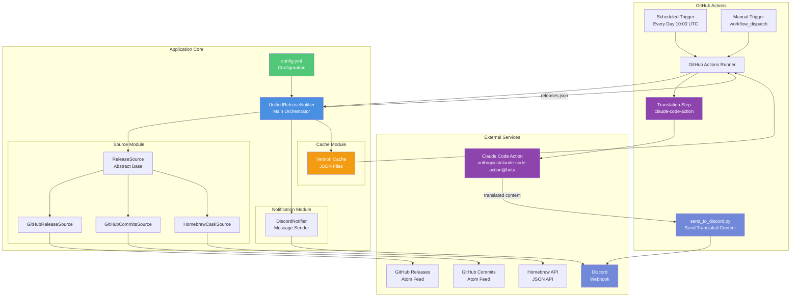
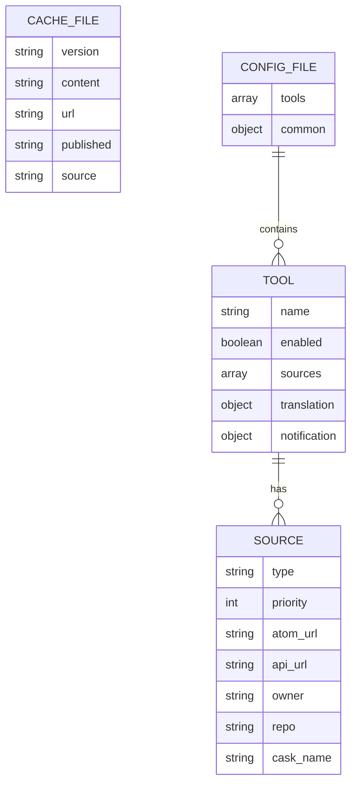
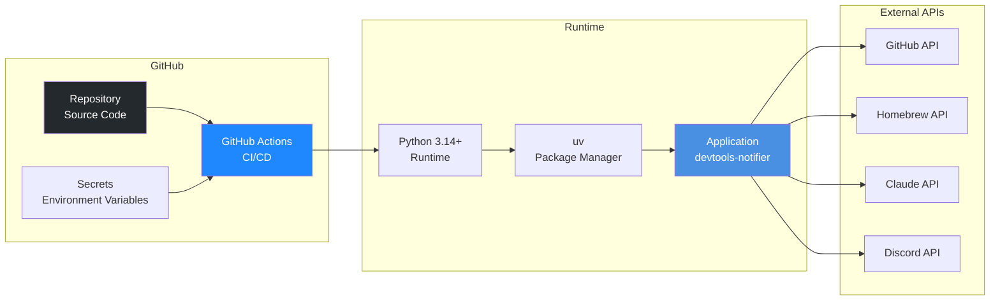
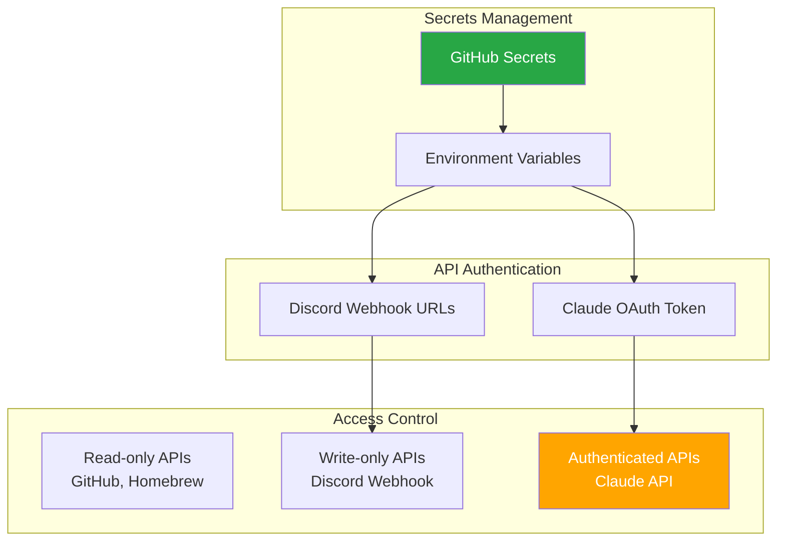
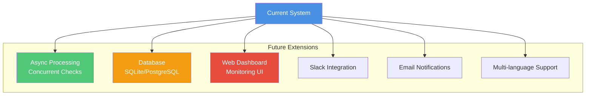

# システムアーキテクチャ

devtools-release-notifierのシステムアーキテクチャ図です。

## 全体アーキテクチャ

## コンポーネント説明

### External Services

- **GitHub Releases/Commits**: Atomフィード形式でリリース情報を提供
- **Homebrew API**: JSON形式でパッケージ情報を提供
- **Claude Code Action**: anthropics/claude-code-action@betaによる翻訳・要約サービス
- **Discord Webhook**: 通知配信サービス

### GitHub Actions

- **Scheduled Trigger**: 毎日10:00 UTCに自動実行
- **Manual Trigger**: 手動実行用のトリガー
- **Runner**: ワークフロー実行環境
- **Translation Step**: claude-code-actionを使用した翻訳処理
- **send_to_discord.py**: 翻訳されたコンテンツをDiscordに送信するスクリプト

### Application Core

#### UnifiedReleaseNotifier

- システムの中核となるオーケストレーター
- 各ツールの処理を統括
- 優先度ベースのソース選択
- キャッシュ管理
- エラーハンドリング

#### Source Module

- **ReleaseSource**: 情報源の抽象基底クラス
- **GitHubReleaseSource**: GitHub Releasesから情報取得
- **GitHubCommitsSource**: GitHub Commitsから情報取得
- **HomebrewCaskSource**: Homebrew APIから情報取得

#### Notification Module

- **DiscordNotifier**: Discord Webhookへの通知送信
- リッチ埋め込みメッセージ形式

#### Cache Module

- **Version Cache**: JSONファイル形式でバージョン情報を永続化
- 重複通知の防止

## データストア

## デプロイメント構成

## セキュリティ考慮事項

## スケーラビリティ

現在の設計は以下の点でスケーラブルです：

1. **ツールの追加**: `config.yml`に新しいツールを追加するだけで対応可能
2. **情報源の追加**: 新しいSourceクラスを実装するだけで対応可能
3. **翻訳サービスの追加**: Translatorクラスを拡張するだけで対応可能
4. **非同期処理**: httpxを使用しているため、将来的に非同期処理に移行可能

## 将来の拡張可能性

## 技術選択の理由

### httpx

- 非同期対応（将来の拡張性）
- HTTP/2サポート
- より良いタイムアウト管理
- requestsの後継として設計

### uv

- 高速なパッケージ解決
- 一貫した依存関係管理
- 仮想環境の自動管理

### pydantic

- 型安全なデータ検証
- 設定管理の簡素化
- 将来的なAPI統合の容易性

### feedparser

- 実績のあるRSS/Atom解析ライブラリ
- GitHub Atomフィードとの互換性

### Claude API

- 高品質な日本語翻訳
- 技術文書の適切な要約
- コンテキスト理解能力
