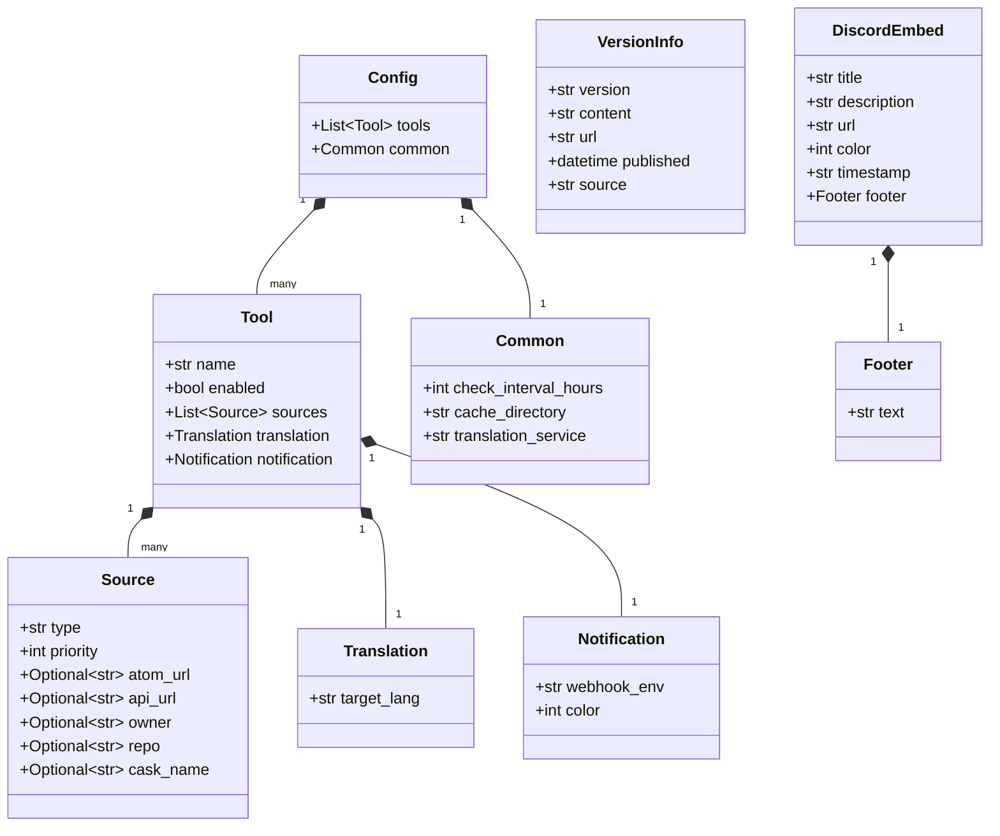
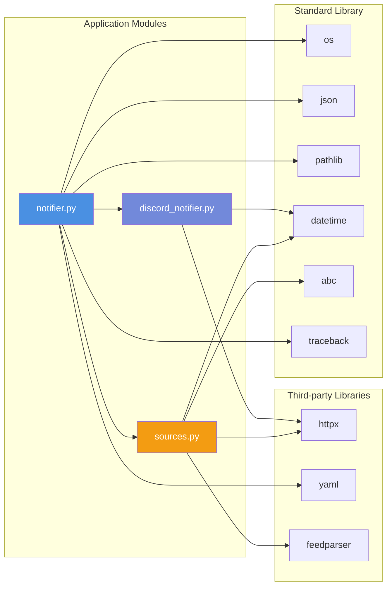

# クラス図

devtools-release-notifierのクラス構造とその関係を示します。

## 主要クラス図


## データモデル



## モジュール構成

```mermaid
graph TB
    subgraph "devtools_release_notifier Package"
        INIT[__init__.py<br/>__version__]

        subgraph "notifier.py"
            MAIN_CLASS[UnifiedReleaseNotifier]
            MAIN_FUNC[main]
        end

        subgraph "sources.py"
            BASE[ReleaseSource]
            GHR[GitHubReleaseSource]
            GHC[GitHubCommitsSource]
            HB[HomebrewCaskSource]
        end

        subgraph "discord_notifier.py"
            NOTIF[DiscordNotifier]
        end
    end

    MAIN_CLASS --> BASE
    MAIN_CLASS --> GHR
    MAIN_CLASS --> GHC
    MAIN_CLASS --> HB
    MAIN_CLASS --> NOTIF

    MAIN_FUNC --> MAIN_CLASS

    BASE <|-- GHR
    BASE <|-- GHC
    BASE <|-- HB

    style INIT fill:#50c878,color:#fff
    style MAIN_CLASS fill:#4a90e2,color:#fff
    style BASE fill:#f39c12,color:#fff
    style NOTIF fill:#7289da,color:#fff
```

## 依存関係図


