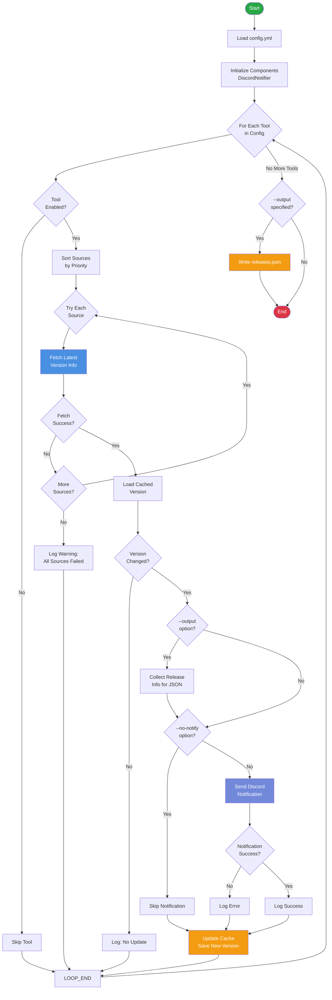
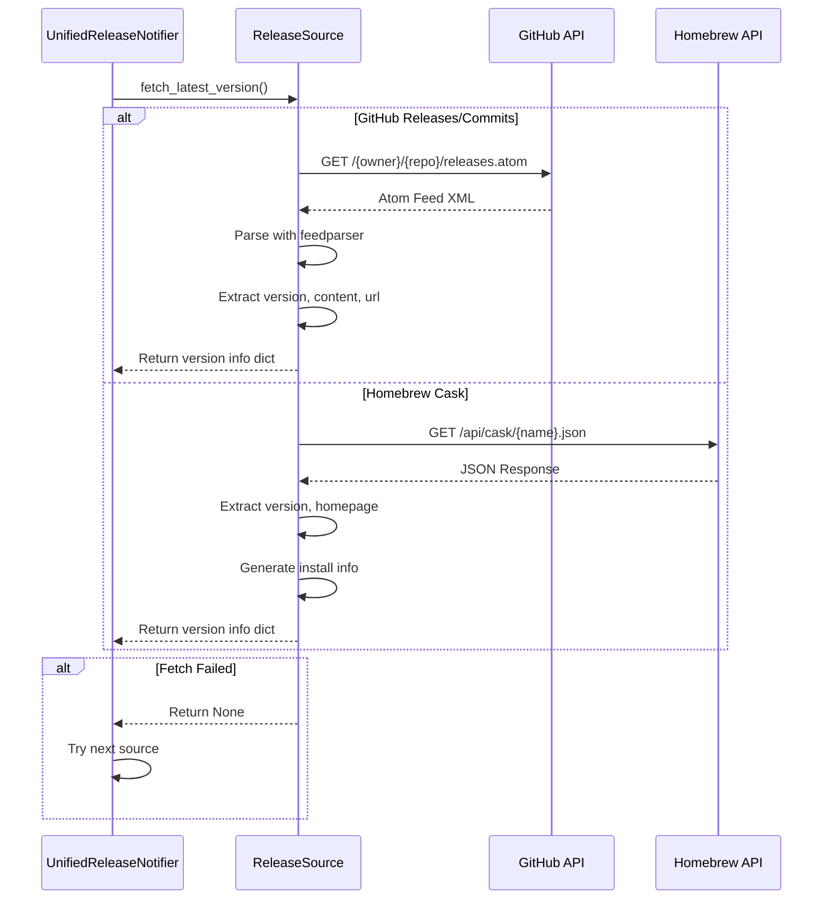
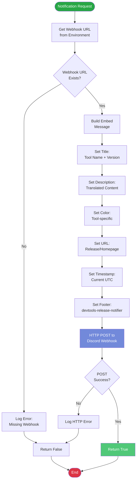
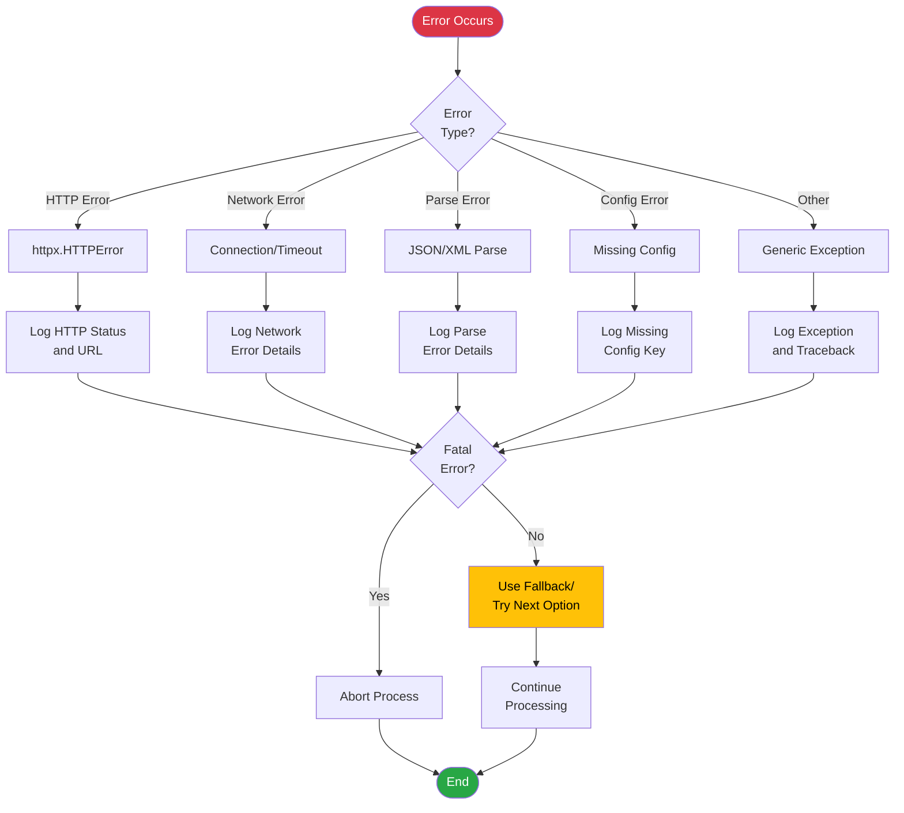
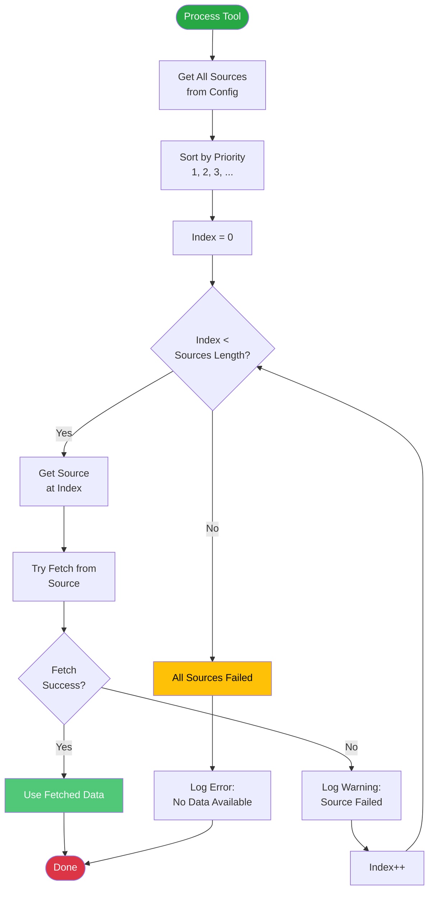
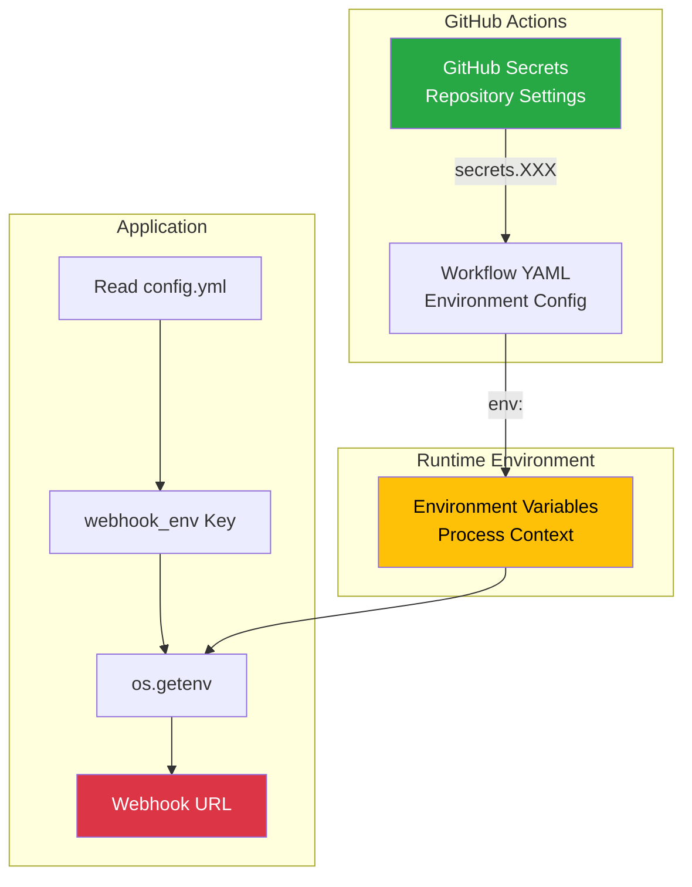
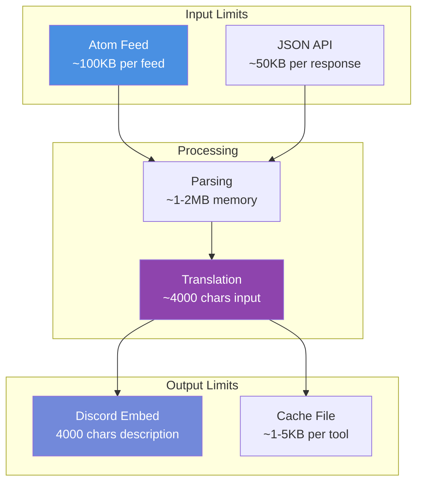

# データフロー

devtools-release-notifierのデータフロー図です。

## 全体のデータフロー



## 情報源からのデータ取得フロー



## GitHub Actions翻訳フロー

```mermaid
flowchart TD
    START([GitHub Actions Start]) --> RUN_NOTIFIER[Run devtools-notifier<br/>--output releases.json --no-notify]

    RUN_NOTIFIER --> CHECK_FILE{releases.json<br/>exists?}

    CHECK_FILE -->|No| NO_RELEASES[No new releases]
    NO_RELEASES --> END

    CHECK_FILE -->|Yes| READ_JSON[Read releases.json]

    READ_JSON --> CLAUDE_ACTION[anthropics/claude-code-action@beta<br/>Translate to Japanese]

    CLAUDE_ACTION --> PARSE_RESPONSE[Parse Translated<br/>JSON Response]

    PARSE_RESPONSE --> SEND_SCRIPT[Run send_to_discord.py<br/>with translated content]

    SEND_SCRIPT --> SEND_SUCCESS{Send<br/>Success?}

    SEND_SUCCESS -->|Yes| COMMIT[Commit cache updates]
    SEND_SUCCESS -->|No| LOG_ERROR[Log Error]

    LOG_ERROR --> COMMIT
    COMMIT --> END([End])

    style START fill:#28a745,color:#fff
    style END fill:#dc3545,color:#fff
    style CLAUDE_ACTION fill:#8e44ad,color:#fff
    style SEND_SCRIPT fill:#7289da,color:#fff
```

## Discord通知フロー



## キャッシュ管理フロー


## エラーハンドリングフロー



## データ変換フロー

```mermaid
flowchart LR
    subgraph "GitHub Releases"
        GHR_RAW[Atom Feed<br/>XML]
        GHR_PARSED[Parsed Entry]
        GHR_DICT[Version Dict]

        GHR_RAW --> |feedparser| GHR_PARSED
        GHR_PARSED --> |extract| GHR_DICT
    end

    subgraph "Homebrew API"
        HB_RAW[JSON Response]
        HB_PARSED[Parsed Object]
        HB_DICT[Version Dict]

        HB_RAW --> |json.loads| HB_PARSED
        HB_PARSED --> |transform| HB_DICT
    end

    subgraph "Unified Format"
        UNIFIED[{
            version: str,
            content: str,
            url: str,
            published: datetime,
            source: str
        }]
    end

    GHR_DICT --> UNIFIED
    HB_DICT --> UNIFIED

    subgraph "JSON Output (--output)"
        JSON_OUTPUT[{
            tool_name: str,
            version: str,
            content: str,
            url: str,
            color: int,
            webhook_env: str
        }]
    end

    UNIFIED --> JSON_OUTPUT

    subgraph "GitHub Actions Translation"
        TRANS_IN[releases.json]
        CLAUDE_TRANS[claude-code-action<br/>Translation]
        TRANS_OUT[Translated JSON]

        TRANS_IN --> CLAUDE_TRANS
        CLAUDE_TRANS --> TRANS_OUT
    end

    JSON_OUTPUT --> TRANS_IN

    subgraph "Discord Message"
        DISCORD_EMBED[{
            title: str,
            description: str,
            url: str,
            color: int,
            timestamp: str,
            footer: obj
        }]
    end

    TRANS_OUT --> |send_to_discord.py| DISCORD_EMBED

    style UNIFIED fill:#4a90e2,color:#fff
    style JSON_OUTPUT fill:#f39c12,color:#fff
    style CLAUDE_TRANS fill:#8e44ad,color:#fff
    style DISCORD_EMBED fill:#7289da,color:#fff
```

## 優先度ベースのソース選択フロー



## 環境変数とシークレット管理



## 時系列データフロー

```mermaid
gantt
    title Processing Timeline for Multiple Tools
    dateFormat X
    axisFormat %s

    section Tool 1 (Zed)
    Load Config         :0, 1s
    Fetch from GitHub   :1, 3s
    Translate           :4, 5s
    Send to Discord     :9, 2s
    Update Cache        :11, 1s

    section Tool 2 (Dia)
    Wait for Tool 1     :0, 12s
    Fetch from Homebrew :12, 2s
    Translate           :14, 5s
    Send to Discord     :19, 2s
    Update Cache        :21, 1s
```



## データサイズと制限


