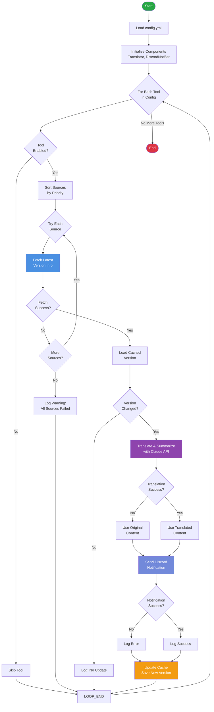
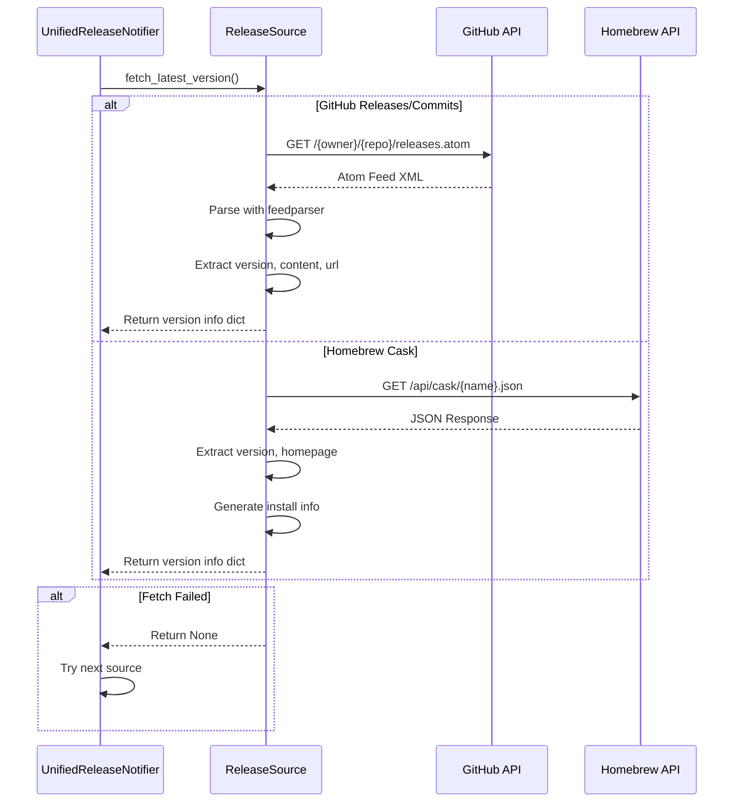
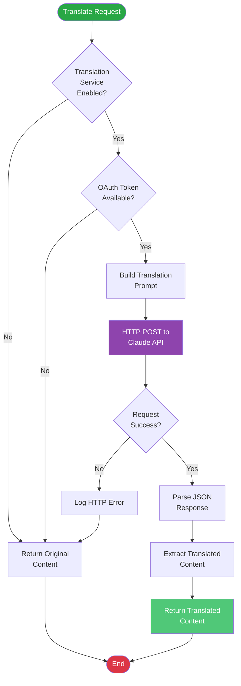
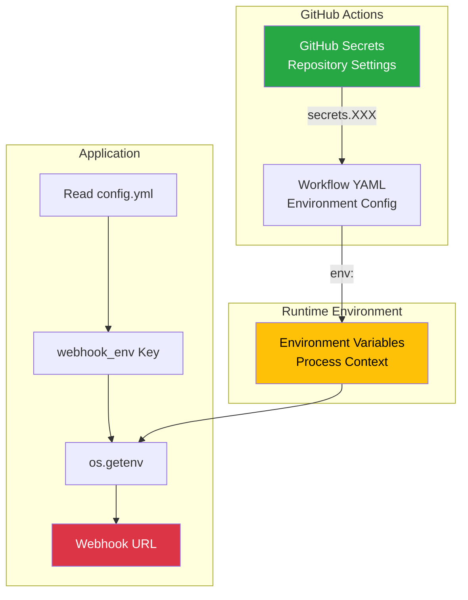
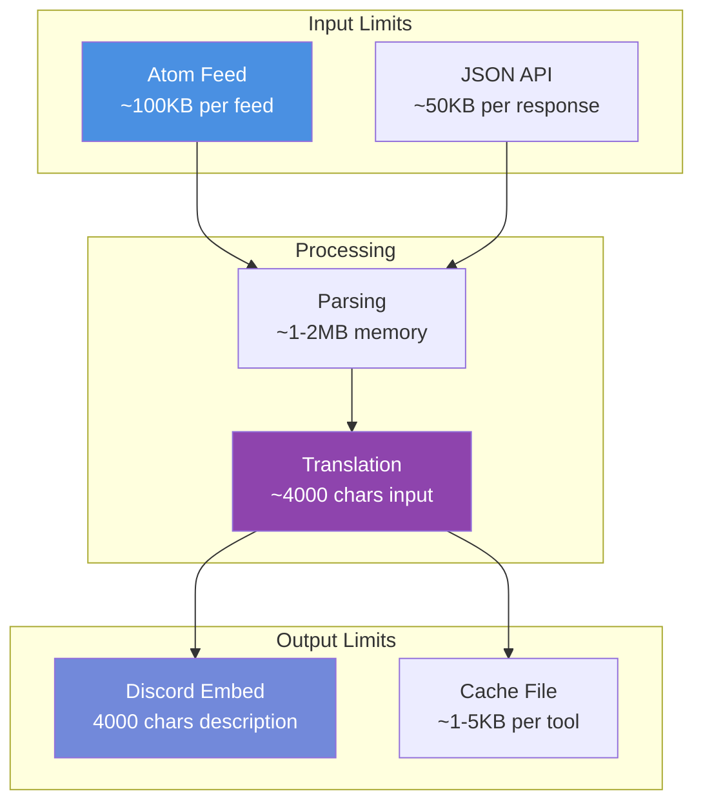

# データフロー

devtools-release-notifierのデータフロー図です。

## 全体のデータフロー



## 情報源からのデータ取得フロー



## 翻訳フロー



## Discord通知フロー


## キャッシュ管理フロー

```mermaid
flowchart TD
    subgraph "Load Cache"
        L_START([Load Request]) --> L_PATH[Generate Cache<br/>File Path]
        L_PATH --> L_EXISTS{File<br/>Exists?}
        L_EXISTS -->|No| L_NONE[Return None]
        L_EXISTS -->|Yes| L_READ[Read JSON File]
        L_READ --> L_PARSE[Parse JSON]
        L_PARSE --> L_RETURN[Return Dict]
    end

    subgraph "Save Cache"
        S_START([Save Request]) --> S_PATH[Generate Cache<br/>File Path]
        S_PATH --> S_CREATE[Create Cache Dir<br/>if Not Exists]
        S_CREATE --> S_SERIALIZE[Serialize to JSON<br/>ISO Format Dates]
        S_SERIALIZE --> S_WRITE[Write to File]
        S_WRITE --> S_END([End])
    end

    subgraph "Compare Versions"
        C_START([Compare Request]) --> C_LOAD[Load Cached<br/>Version]
        C_LOAD --> C_EXISTS{Cache<br/>Exists?}
        C_EXISTS -->|No| C_NEW[Return: New Version]
        C_EXISTS -->|Yes| C_COMPARE{Versions<br/>Match?}
        C_COMPARE -->|Yes| C_SAME[Return: No Change]
        C_COMPARE -->|No| C_NEW
    end

    style L_START fill:#28a745,color:#fff
    style S_START fill:#28a745,color:#fff
    style C_START fill:#28a745,color:#fff
    style S_END fill:#dc3545,color:#fff
    style C_NEW fill:#f39c12,color:#fff
    style C_SAME fill:#6c757d,color:#fff
```



## エラーハンドリングフロー


## データ変換フロー

```mermaid
flowchart LR
    subgraph "GitHub Releases"
        GHR_RAW[Atom Feed<br/>XML]
        GHR_PARSED[Parsed Entry]
        GHR_DICT[Version Dict]

        GHR_RAW --> |feedparser| GHR_PARSED
        GHR_PARSED --> |extract| GHR_DICT
    end

    subgraph "Homebrew API"
        HB_RAW[JSON Response]
        HB_PARSED[Parsed Object]
        HB_DICT[Version Dict]

        HB_RAW --> |json.loads| HB_PARSED
        HB_PARSED --> |transform| HB_DICT
    end

    subgraph "Unified Format"
        UNIFIED[{
            version: str,
            content: str,
            url: str,
            published: datetime,
            source: str
        }]
    end

    GHR_DICT --> UNIFIED
    HB_DICT --> UNIFIED

    subgraph "Translation"
        TRANS_IN[Original Content<br/>English]
        TRANS_OUT[Translated Content<br/>Japanese]

        TRANS_IN --> |Claude API| TRANS_OUT
    end

    UNIFIED --> TRANS_IN

    subgraph "Discord Message"
        DISCORD_EMBED[{
            title: str,
            description: str,
            url: str,
            color: int,
            timestamp: str,
            footer: obj
        }]
    end

    TRANS_OUT --> DISCORD_EMBED

    style UNIFIED fill:#4a90e2,color:#fff
    style TRANS_OUT fill:#8e44ad,color:#fff
    style DISCORD_EMBED fill:#7289da,color:#fff
```

## 優先度ベースのソース選択フロー


## 環境変数とシークレット管理



## 時系列データフロー

```mermaid
gantt
    title Processing Timeline for Multiple Tools
    dateFormat X
    axisFormat %s

    section Tool 1 (Zed)
    Load Config         :0, 1s
    Fetch from GitHub   :1, 3s
    Translate           :4, 5s
    Send to Discord     :9, 2s
    Update Cache        :11, 1s

    section Tool 2 (Dia)
    Wait for Tool 1     :0, 12s
    Fetch from Homebrew :12, 2s
    Translate           :14, 5s
    Send to Discord     :19, 2s
    Update Cache        :21, 1s
```



## データサイズと制限


