# シーケンス図

devtools-release-notifierの主要な処理シーケンスを示します。

## メイン処理シーケンス

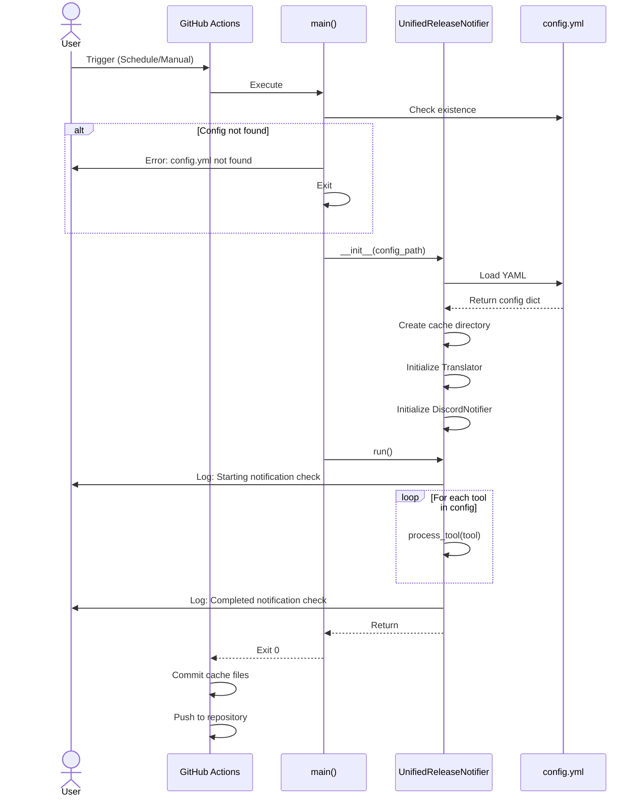

## ツール処理シーケンス（詳細）

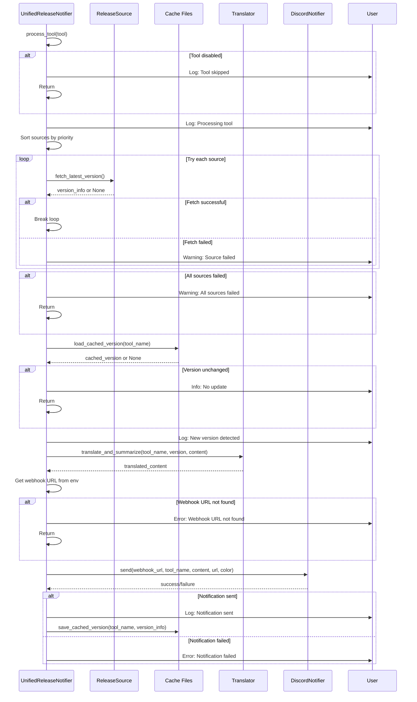

## GitHub Releases ソース取得シーケンス

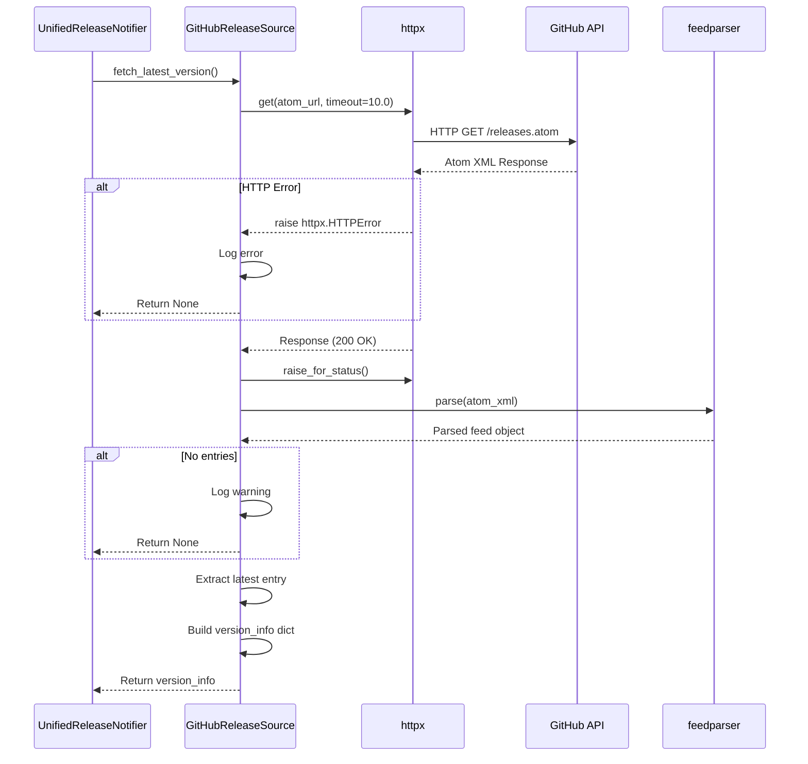

## Homebrew API ソース取得シーケンス

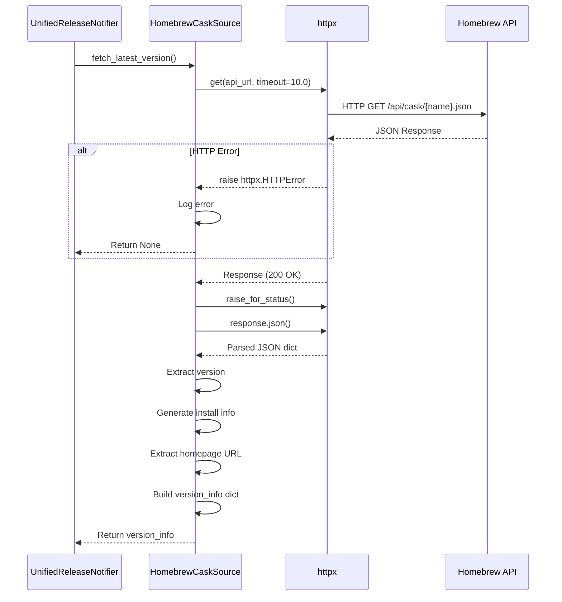

## 翻訳処理シーケンス

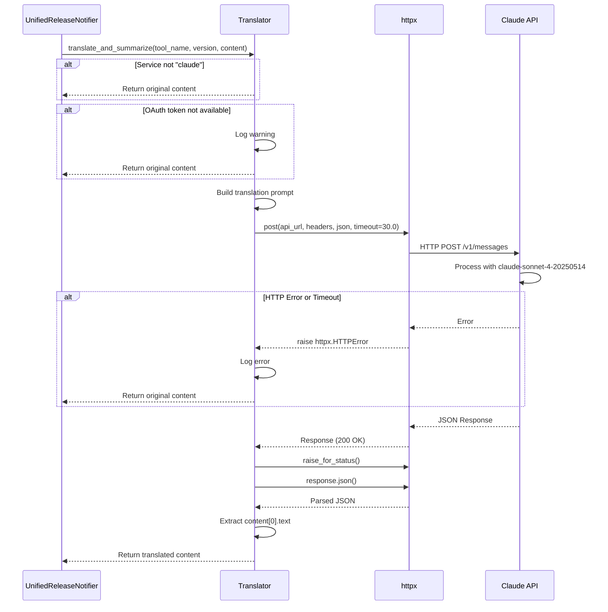

## Discord通知シーケンス

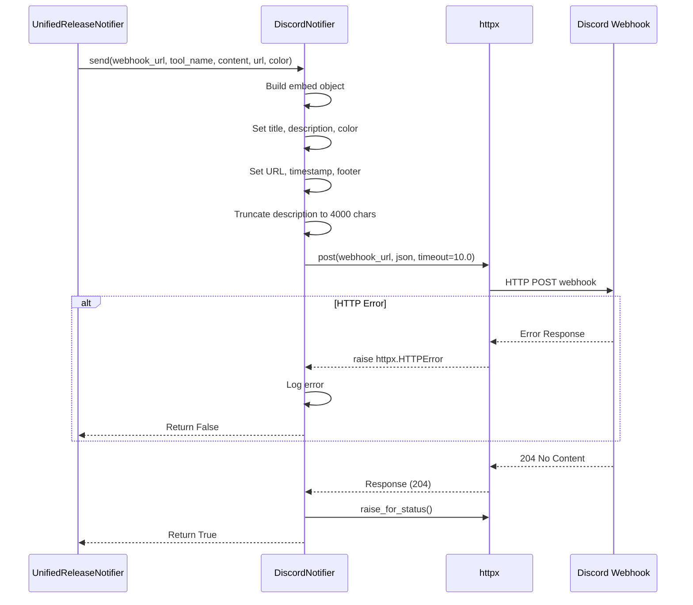

## キャッシュ読み込みシーケンス

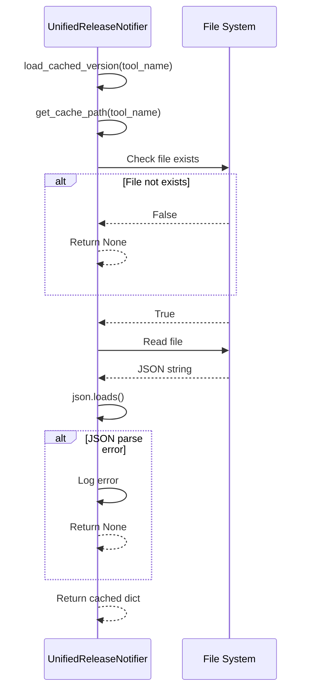

## キャッシュ保存シーケンス

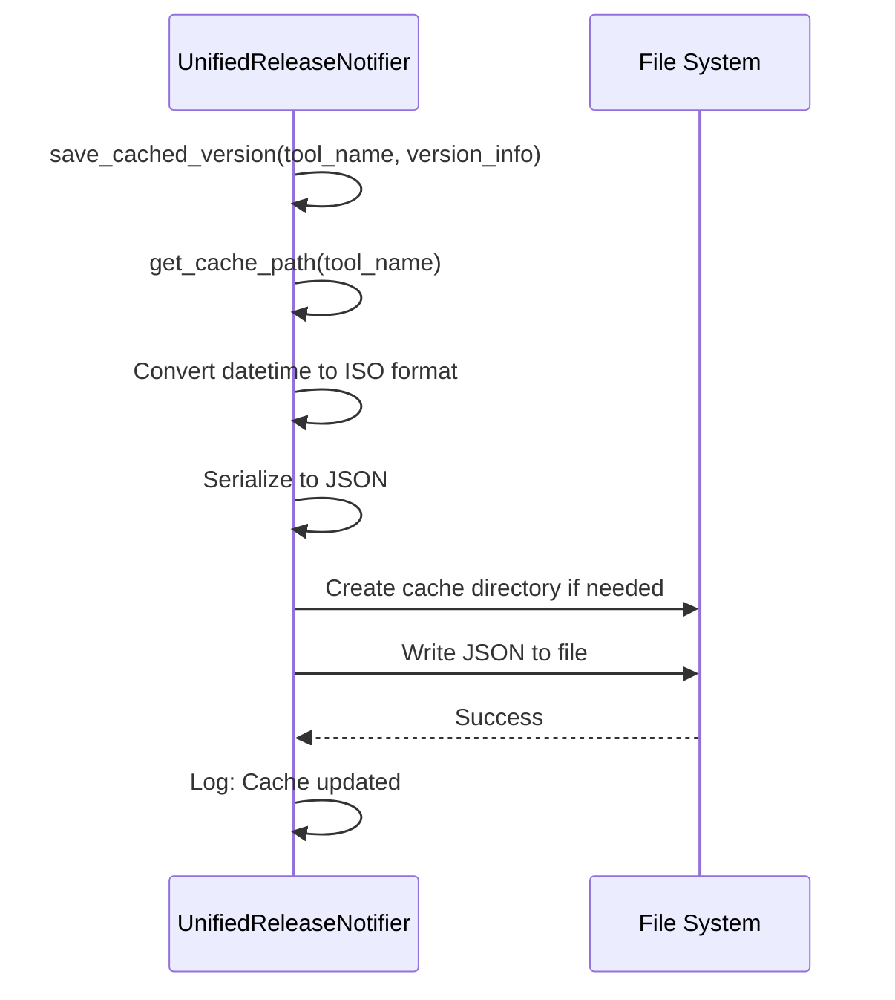

## エラーハンドリングシーケンス

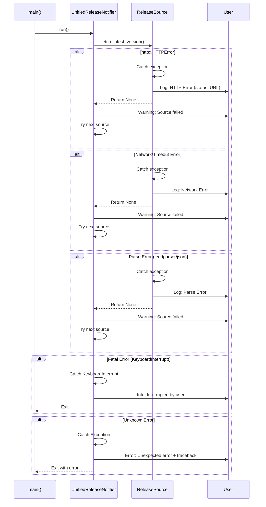

## GitHub Actions統合シーケンス

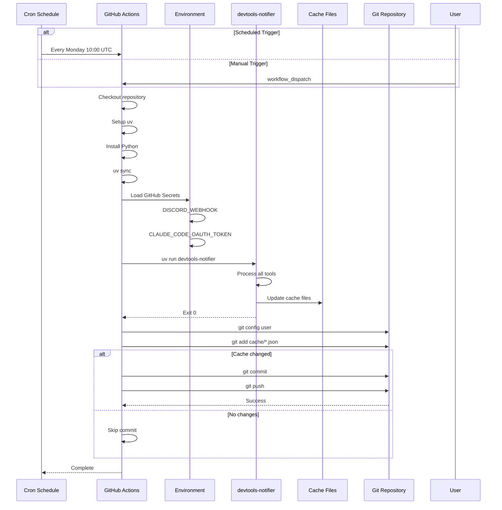

## 優先度ベースのフォールバックシーケンス

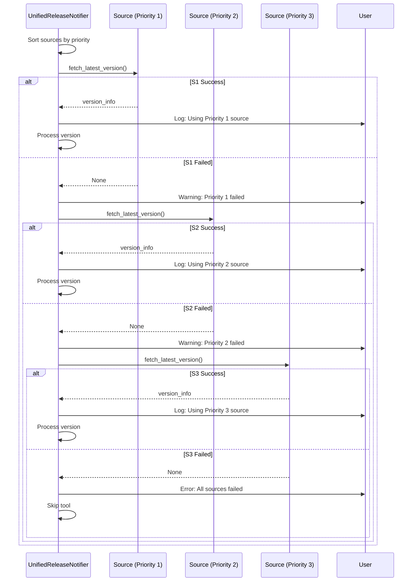

## 設定読み込みシーケンス

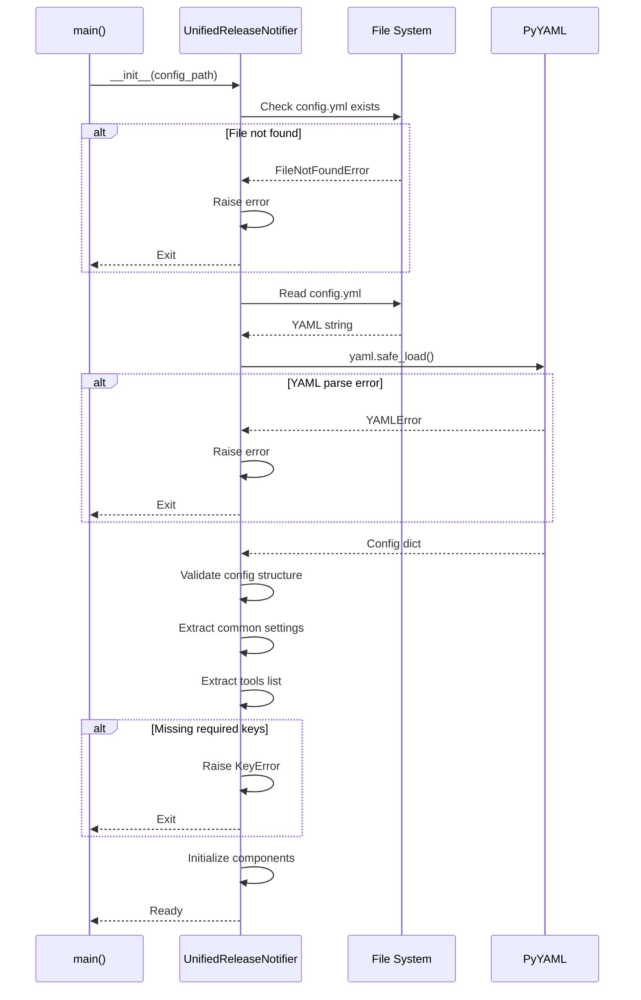

## 完全な実行フローシーケンス

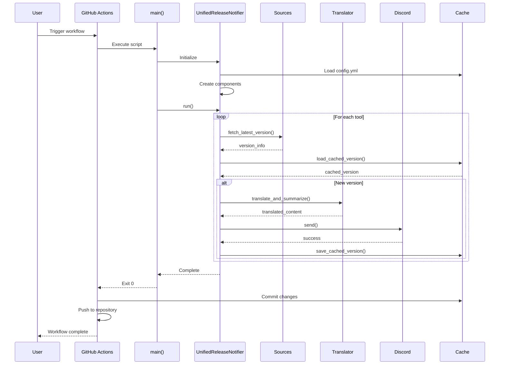
